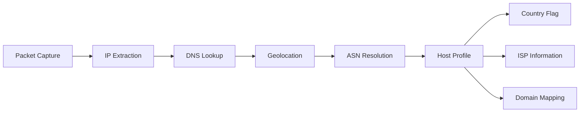

# InnoMonitor User Guide v1.1.0

> **🎯 Complete guide to mastering network monitoring and activity tracking with InnoMonitor**

[](README.md)
[](#installation)
[](#getting-started)

Welcome to **InnoMonitor** - your advanced network traffic and activity monitoring companion! This comprehensive guide will help you master every feature and get the most value from real-time network intelligence.

---

## 📋 Quick Navigation

| Section | Description | Time to Complete |
|---------|-------------|------------------|
| **[🚀 Getting Started](#-getting-started)** | Installation & first run | 5 minutes |
| **[🎨 Interface Guide](#-understanding-the-interface)** | Master the dashboard | 10 minutes |
| **[🌐 Network Monitoring](#-network-monitoring)** | Real-time traffic analysis | 15 minutes |
| **[📊 Activity Tracking](#-activity-tracking)** | Productivity insights | 10 minutes |
| **[⚙️ Configuration](#-settings--configuration)** | Customize your experience | 10 minutes |
| **[🔧 Troubleshooting](#-troubleshooting)** | Solve common issues | As needed |

---

## 🚀 Getting Started

### 📥 Installation

#### 🪟 Windows Installation

##### Prerequisites
- **Windows 10/11** (64-bit)
- **Administrator privileges** for packet capture
- **4GB RAM** minimum (8GB recommended)
- **100MB free disk space**

##### Step-by-Step Installation
1. **Download the installer**
   ```powershell
   # Download latest release
   Invoke-WebRequest -Uri "https://github.com/omnimuh730/rs-fairsight/releases/latest/download/InnoMonitor-setup.msi" -OutFile "InnoMonitor-setup.msi"
   ```

2. **Run with administrator privileges**
   - Right-click `InnoMonitor-setup.msi`
   - Select "Run as administrator"
   - Follow the installation wizard

3. **Install Npcap (Required)**
   - Npcap will be automatically prompted during installation
   - ✅ Check "Install Npcap in WinPcap API-compatible mode"
   - ✅ Check "Support raw 802.11 traffic"

4. **Verify installation**
   - Launch InnoMonitor from Start Menu
   - You should see the main dashboard

##### Windows-Specific Features
- **🔐 Admin Mode Detection**: Automatic privilege elevation prompts
- **🚀 Auto-Startup**: Configurable system boot integration  
- **📱 System Tray**: Minimize to tray for background monitoring
- **🔔 Windows Notifications**: Native notification integration

---

#### 🍎 macOS Installation

##### Prerequisites
- **macOS 10.15+** (Catalina or newer)
- **Administrator access** for packet capture permissions
- **4GB RAM** minimum
- **100MB free disk space**

##### Step-by-Step Installation
1. **Download and mount**
   ```bash
   # Download latest release
   curl -L "https://github.com/omnimuh730/rs-fairsight/releases/latest/download/InnoMonitor.dmg" -o InnoMonitor.dmg
   
   # Mount the disk image
   hdiutil attach InnoMonitor.dmg
   ```

2. **Install application**
   - Drag `InnoMonitor.app` to `/Applications/`
   - Eject the disk image

3. **Grant permissions**
   ```bash
   # Grant packet capture permissions
   sudo chmod +r /dev/bpf*
   
   # Or add user to admin group
   sudo dseditgroup -o edit -a $(whoami) -t user admin
   ```

4. **First launch**
   - Launch from Applications folder
   - Click "Open" when prompted by Gatekeeper
   - Grant network access permissions

##### macOS-Specific Features
- **🔒 Keychain Integration**: Secure credential storage
- **📊 Menu Bar Integration**: Quick access from menu bar
- **🍎 Native Notifications**: macOS notification center support
- **⚡ Metal Acceleration**: Optimized graphics performance

---

#### 🐧 Linux Installation

##### Prerequisites
- **Ubuntu 20.04+ / Fedora 35+ / Arch Linux**
- **libpcap-dev** package
- **sudo privileges**
- **4GB RAM** minimum

##### Package Installation
```bash
# Ubuntu/Debian
sudo apt update
sudo apt install libpcap-dev
wget https://github.com/omnimuh730/rs-fairsight/releases/latest/download/InnoMonitor.deb
sudo dpkg -i InnoMonitor.deb

# Fedora/RHEL
sudo dnf install libpcap-devel
wget https://github.com/omnimuh730/rs-fairsight/releases/latest/download/InnoMonitor.rpm
sudo rpm -i InnoMonitor.rpm

# Arch Linux
sudo pacman -S libpcap
wget https://github.com/omnimuh730/rs-fairsight/releases/latest/download/InnoMonitor.AppImage
chmod +x InnoMonitor.AppImage
./InnoMonitor.AppImage
```

##### Permission Setup
```bash
# Grant network capture permissions
sudo setcap cap_net_raw,cap_net_admin=eip /usr/bin/innomonitor

# Or run with sudo (less recommended)
sudo /usr/bin/innomonitor
```

##### Linux-Specific Features
- **🐧 Systemd Integration**: Service management support
- **📊 X11/Wayland Support**: Native desktop integration
- **🔧 CLI Interface**: Command-line monitoring options
- **📦 Package Managers**: Native package installation

---

### 🎯 First Run Setup

#### 1. **Launch Application**
- **Windows**: Start Menu → InnoMonitor
- **macOS**: Applications → InnoMonitor.app
- **Linux**: Application menu → InnoMonitor

#### 2. **Initial Configuration Wizard**

##### Network Adapter Selection
```
🌐 Network Adapter Setup
┌─────────────────────────────────────┐
│ Select your primary network adapter │
│                                     │
│ ○ Ethernet (Realtek PCIe GbE)      │
│ ● Wi-Fi (Intel AX200)              │ ← Recommended for laptops
│ ○ VPN (OpenVPN TAP-Windows)        │
│                                     │
│ [Auto-detect] [Manual Selection]    │
└─────────────────────────────────────┘
```

**💡 Pro Tips:**
- **WiFi users**: Select your wireless adapter
- **Ethernet users**: Choose your wired connection
- **VPN users**: Monitor both VPN and underlying connection
- **Multi-adapter**: InnoMonitor can monitor multiple adapters simultaneously

##### Privacy & Data Settings
```
🔒 Privacy Configuration
┌─────────────────────────────────────┐
│ Configure data handling preferences │
│                                     │
│ ✅ Local processing only            │
│ ✅ Encrypted local storage          │
│ ✅ No cloud synchronization         │
│ ❌ Anonymous usage statistics       │
│                                     │
│ [Review Policy] [Continue]          │
└─────────────────────────────────────┘
```

#### 3. **Verify Setup**

##### System Check
InnoMonitor will automatically verify:
- ✅ **Network adapter access**
- ✅ **Packet capture permissions**  
- ✅ **Disk space availability**
- ✅ **System resources**

##### Test Monitoring
```
🔍 Testing Network Capture
┌─────────────────────────────────────┐
│ Status: Capturing packets...        │
│                                     │
│ Packets captured: 1,247             │
│ Data processed: 2.4 MB              │
│ Hosts discovered: 15                │
│                                     │
│ ✅ Network monitoring operational   │
└─────────────────────────────────────┘
```

---

## 🎨 Understanding the Interface

### 🏠 Main Dashboard Overview

#### Layout Structure
```
┌─────────────────────────────────────────────────────────────┐
│ 📊 InnoMonitor Dashboard                    🔍 🔧 ⚙️ ❓    │
├─────────────────────────────────────────────────────────────┤
│                                                             │
│ 🌐 Network Overview          📈 Real-time Charts           │
│ ┌─────────────────────┐    ┌─────────────────────────────┐  │
│ │ Total Traffic       │    │     Traffic Over Time       │  │
│ │ ↗ 245.7 MB         │    │ 100 ┌─╮                    │  │
│ │ ↘ 89.3 MB          │    │  MB │ │ ╭─╮                │  │
│ │                     │    │   0 └─┘ ╰─╯                │  │
│ │ Active Hosts: 23    │    │     12:00  12:15  12:30    │  │
│ │ Services: 15        │    └─────────────────────────────┘  │
│ └─────────────────────┘                                     │
│                                                             │
│ 🌍 Top Hosts                📋 Network Services           │
│ ┌─────────────────────┐    ┌─────────────────────────────┐  │
│ │ 🇺🇸 8.8.8.8         │    │ HTTPS    │ 156.2 MB │ 67%  │  │
│ │    Google DNS       │    │ HTTP     │  45.7 MB │ 19%  │  │
│ │    45.2 MB ↗        │    │ DNS      │  12.1 MB │  5%  │  │
│ │                     │    │ SSH      │   8.9 MB │  4%  │  │
│ │ 🇩🇪 142.250.191.78  │    │ Other    │  11.1 MB │  5%  │  │
│ │    Google           │    └─────────────────────────────┘  │
│ │    23.8 MB ↗        │                                     │
│ └─────────────────────┘                                     │
└─────────────────────────────────────────────────────────────┘
```

#### Interactive Elements

##### 1. **📊 Real-time Metrics Cards**
- **Traffic Counters**: Live upload/download statistics
- **Host Counter**: Number of unique network hosts
- **Service Counter**: Detected network services
- **Click behavior**: Click for detailed breakdowns

##### 2. **📈 Interactive Charts**
```javascript
// Chart features
- 🔍 Zoom: Mouse wheel to zoom time periods
- 📍 Tooltip: Hover for exact values
- 🎯 Filter: Click legend to toggle data series
- 📊 Export: Right-click for data export options
```

##### 3. **🌍 Geographic Host Map**
- **Country flags**: Visual country identification
- **ASN information**: Internet service provider details
- **Traffic flow**: Directional traffic indicators
- **Security status**: Threat intelligence integration

##### 4. **🔔 Status Indicators**

| Indicator | Meaning | Action Required |
|-----------|---------|-----------------|
| 🟢 **Active** | Normal monitoring | None |
| 🟡 **Reconnecting** | Adapter connection issue | Check network |
| 🔴 **Stopped** | Monitoring paused | Start monitoring |
| ⚠️ **Permission** | Insufficient privileges | Run as admin |

---

### 🌐 Network Monitoring

#### 📡 Real-time Traffic Analysis

##### Traffic Direction Detection
```
📊 Traffic Flow Analysis
┌─────────────────────────────────────┐
│ Incoming (Download) ⬇               │
│ ████████████████░░░░ 156.2 MB (78%) │
│                                     │
│ Outgoing (Upload) ⬆                 │
│ ████░░░░░░░░░░░░░░░░  45.7 MB (22%) │
│                                     │
│ Ratio: 3.4:1 (Download heavy)       │
└─────────────────────────────────────┘
```

##### Protocol Breakdown
InnoMonitor automatically identifies and categorizes network protocols:

| Protocol | Purpose | Typical Usage |
|----------|---------|---------------|
| **HTTPS** | Secure web traffic | Web browsing, APIs |
| **HTTP** | Web traffic | Legacy websites |
| **DNS** | Domain resolution | All internet activity |
| **SSH** | Secure remote access | Development, administration |
| **SMTP** | Email sending | Email clients |
| **IMAP/POP3** | Email retrieval | Email clients |
| **FTP** | File transfer | File sharing |
| **BitTorrent** | P2P file sharing | Media downloads |

#### 🌍 Geographic & Host Analysis

##### Host Discovery Process


##### Host Information Display
```
🌍 Host Analysis: 8.8.8.8
┌─────────────────────────────────────┐
│ 🇺🇸 United States                   │
│ 🏢 Google LLC (AS15169)             │
│ 🌐 dns.google                       │
│ 📊 Traffic: 45.2 MB ⬇ | 12.1 MB ⬆  │
│ 🕒 First seen: 14:32:15             │
│ 🔄 Last activity: 14:45:23          │
│                                     │
│ Services detected:                  │
│ • DNS (Port 53) - 98% of traffic   │
│ • HTTPS (Port 443) - 2% of traffic │
└─────────────────────────────────────┘
```

##### Advanced Analytics
- **🔍 Deep Packet Inspection**: Application-layer protocol analysis
- **🚫 Deduplication**: Prevents counting same data multiple times
- **⏱️ Time-based Analysis**: Traffic patterns over time
- **🎯 Anomaly Detection**: Unusual traffic pattern identification

#### 🔧 Service & Port Analysis

##### Automatic Service Detection
InnoMonitor recognizes 50+ common services:

```
📋 Service Analysis
┌─────────────────────────────────────┐
│ Port │ Protocol │ Service │ Traffic │
├─────────────────────────────────────┤
│  443 │   TCP    │ HTTPS  │ 156.2MB │
│   80 │   TCP    │ HTTP   │  45.7MB │
│   53 │   UDP    │ DNS    │  12.1MB │
│   22 │   TCP    │ SSH    │   8.9MB │
│  993 │   TCP    │ IMAPS  │   5.4MB │
│  587 │   TCP    │ SMTP   │   3.2MB │
└─────────────────────────────────────┘
```

##### Custom Service Recognition
Add custom services for specialized monitoring:
```json
{
  "custom_services": {
    "8080": { "name": "Development Server", "protocol": "HTTP-Alt" },
    "3306": { "name": "MySQL Database", "protocol": "MySQL" },
    "5432": { "name": "PostgreSQL", "protocol": "PostgreSQL" }
  }
}
```

---

### 📊 Activity Tracking

#### ⏱️ Time & Productivity Monitoring

##### Activity Categories
```
📈 Daily Activity Breakdown
┌─────────────────────────────────────┐
│ 💻 Development    │ 6h 23m │ ████████ │
│ 🌐 Web Browsing   │ 2h 15m │ ███░░░░░ │
│ 📧 Email & Comm   │ 1h 42m │ ██░░░░░░ │
│ 🎮 Entertainment  │ 1h 08m │ █░░░░░░░ │
│ ⚙️ System Admin   │ 0h 45m │ █░░░░░░░ │
│ 💤 Idle Time      │ 3h 47m │ ████░░░░ │
└─────────────────────────────────────┘
```

##### Productivity Insights
- **🎯 Focus Time**: Continuous work periods without interruption
- **📱 Distraction Analysis**: Time spent on non-productive activities
- **⚡ Peak Hours**: Most productive time periods
- **📊 Weekly Trends**: Productivity patterns over time

#### 🏥 Health & Wellness Monitoring

##### Break Reminders
```
🏥 Health Monitoring
┌─────────────────────────────────────┐
│ ⏰ Current session: 2h 15m          │
│ 👀 Screen time today: 8h 42m        │
│                                     │
│ 💡 Recommendations:                 │
│ • Take a 15-minute break            │
│ • Look away from screen (20-20-20)  │
│ • Stretch and move around           │
│                                     │
│ Next break in: 5 minutes            │
└─────────────────────────────────────┘
```

##### Health Analytics
- **👁️ Eye strain prevention**: 20-20-20 rule reminders
- **🧘 Break patterns**: Optimal break timing suggestions
- **📊 Screen time tracking**: Daily and weekly screen time analysis
- **⚖️ Work-life balance**: Overtime detection and warnings

---

### ⚙️ Settings & Configuration

#### 🔧 Network Configuration

##### Adapter Management
```
🌐 Network Adapter Settings
┌─────────────────────────────────────┐
│ Primary Adapter:                    │
│ ● Wi-Fi (Intel AX200)              │
│   Status: ✅ Active                 │
│   Speed: 866 Mbps                  │
│                                     │
│ Secondary Adapters:                 │
│ ○ Ethernet (Realtek)               │
│   Status: 🔌 Disconnected          │
│                                     │
│ ○ VPN (OpenVPN)                    │
│   Status: ⚠️ Limited access        │
│                                     │
│ [ Refresh ] [ Advanced Settings ]   │
└─────────────────────────────────────┘
```

##### Monitoring Preferences
```ini
# Network monitoring configuration
[monitoring]
packet_buffer_size = 8000000    # 8MB buffer
capture_timeout = 100           # 100ms timeout
enable_promiscuous = true       # Monitor all traffic
max_packet_size = 1500         # Standard MTU

[analysis]
enable_geolocation = true       # IP location lookup
enable_dns_resolution = true    # Reverse DNS
enable_asn_lookup = true       # ASN information
cache_duration = 3600          # 1 hour cache
```

#### 🎨 Interface Customization

##### Theme Selection
```
🎨 Appearance Settings
┌─────────────────────────────────────┐
│ Theme:                              │
│ ● Light theme                       │
│ ○ Dark theme                        │ 
│ ○ Auto (system preference)          │
│                                     │
│ Chart Style:                        │
│ ● Modern (gradients)                │
│ ○ Classic (solid colors)            │
│                                     │
│ Update Frequency:                   │
│ ○ Real-time (1 second)             │
│ ● Balanced (2 seconds)             │
│ ○ Conservative (5 seconds)          │
└─────────────────────────────────────┘
```

##### Dashboard Layout
Customize dashboard components:
- **📊 Widget arrangement**: Drag and drop dashboard widgets
- **📈 Chart preferences**: Choose chart types and time ranges
- **🌍 Map settings**: Geographic visualization options
- **🔔 Notification settings**: Alert preferences and thresholds

#### 🔒 Privacy & Security

##### Data Protection Settings
```
🔒 Privacy & Security
┌─────────────────────────────────────┐
│ Data Encryption:                    │
│ ✅ Encrypt all stored data          │
│ ✅ Secure key storage               │
│                                     │
│ Data Retention:                     │
│ • Network data: 30 days             │
│ • Activity data: 90 days            │
│ • System logs: 7 days               │
│                                     │
│ Privacy Options:                    │
│ ✅ Local processing only            │
│ ❌ Send anonymous usage data        │
│ ❌ Crash reporting                  │
│                                     │
│ [ Export Data ] [ Clear All Data ]  │
└─────────────────────────────────────┘
```

##### Security Features
- **🔐 AES-256 encryption**: Military-grade data protection
- **🔑 Secure key derivation**: Hardware-based entropy when available
- **🏠 Local-only processing**: No cloud dependencies
- **🔒 Privilege management**: Minimal required permissions

---

## 💡 Tips & Best Practices

### 🎯 Optimization Strategies

#### 1. **Performance Optimization**
```bash
# Windows: Optimize for monitoring
netsh int tcp set global autotuninglevel=normal
netsh int tcp set global chimney=enabled

# macOS: Increase buffer limits
sudo sysctl -w net.bpf.maxbufsize=8388608

# Linux: Optimize network stack
echo 'net.core.rmem_max = 134217728' | sudo tee -a /etc/sysctl.conf
```

#### 2. **Monitoring Best Practices**
- **🕒 Regular monitoring**: Keep InnoMonitor running for comprehensive insights
- **🔄 Periodic restarts**: Restart weekly to prevent memory buildup
- **💾 Storage management**: Configure appropriate data retention periods
- **🔍 Filter noise**: Use filters to focus on relevant traffic

#### 3. **Security Considerations**
- **👑 Run with appropriate privileges**: Admin access for packet capture
- **🔒 Secure your data**: Use strong system passwords
- **🌐 Network awareness**: Understand what traffic is normal for your environment
- **🚨 Monitor for anomalies**: Set up alerts for unusual traffic patterns

### 📊 Advanced Usage Scenarios

#### 1. **Development Environment Monitoring**
```json
{
  "dev_profile": {
    "focus_ports": [1420, 8080, 5432, 3306],
    "highlight_localhost": true,
    "track_api_calls": true,
    "monitor_database_connections": true
  }
}
```

#### 2. **Home Office Optimization**
- **📈 Bandwidth analysis**: Identify bandwidth-heavy applications
- **⏰ Peak usage detection**: Optimize work schedules around network performance
- **🔒 Security monitoring**: Detect unauthorized network access
- **💰 ISP performance tracking**: Monitor actual vs. advertised speeds

#### 3. **System Administration**
- **🌐 Network troubleshooting**: Identify connectivity issues
- **📊 Capacity planning**: Monitor traffic growth trends
- **🔍 Security analysis**: Detect potential threats and anomalies
- **📋 Compliance reporting**: Generate network usage reports

---

## 🔧 Troubleshooting

### ⚠️ Common Issues & Solutions

#### 1. **❌ "No packet capture permissions"**

##### Windows Solutions:
```powershell
# Check admin privileges
whoami /priv | findstr "SeDebugPrivilege"

# Restart as administrator
Start-Process "C:\Program Files\InnoMonitor\InnoMonitor.exe" -Verb RunAs

# Install/reinstall Npcap
# Download from: https://npcap.org/
```

##### macOS Solutions:
```bash
# Check current user privileges
groups $USER

# Add user to admin group
sudo dseditgroup -o edit -a $USER -t user admin

# Grant packet capture permissions
sudo chmod +r /dev/bpf*
```

##### Linux Solutions:
```bash
# Install libpcap development files
sudo apt install libpcap-dev  # Ubuntu/Debian
sudo dnf install libpcap-devel  # Fedora
sudo pacman -S libpcap  # Arch

# Set capabilities
sudo setcap cap_net_raw,cap_net_admin=eip /usr/bin/innomonitor

# Alternative: Run with sudo
sudo innomonitor
```

#### 2. **🌐 "Network adapter not found"**

##### Diagnosis Steps:
```bash
# Windows: List adapters
ipconfig /all

# macOS/Linux: List interfaces
ifconfig -a
ip link show

# Verify adapter status
ping -c 4 8.8.8.8
```

##### Solutions:
- **🔌 Check physical connections**: Ensure cables are connected
- **🔄 Restart network service**: Disable/enable network adapter
- **🛠️ Update drivers**: Install latest network adapter drivers
- **⚙️ Reset network stack**: Use network troubleshooter

#### 3. **📊 "Dashboard not updating"**

##### Quick Fixes:
```javascript
// Clear browser cache (if using web interface)
Ctrl+Shift+R  // Force refresh

// Restart application
taskkill /f /im InnoMonitor.exe  // Windows
killall InnoMonitor  // macOS/Linux
```

##### Advanced Diagnosis:
```bash
# Check log files
# Windows: %APPDATA%\InnoMonitor\logs\
# macOS: ~/Library/Application Support/InnoMonitor/logs/
# Linux: ~/.local/share/InnoMonitor/logs/

tail -f innomonitor.log
```

#### 4. **💾 "High memory usage"**

##### Memory Optimization:
```json
{
  "performance_settings": {
    "packet_buffer_size": 4000000,
    "host_cache_limit": 1000,
    "data_retention_hours": 24,
    "garbage_collection_interval": 300
  }
}
```

##### Monitoring Tools:
```bash
# Windows: Task Manager
tasklist /fi "imagename eq InnoMonitor.exe" /fo table

# macOS: Activity Monitor or terminal
ps aux | grep InnoMonitor

# Linux: htop or ps
top -p $(pgrep InnoMonitor)
```

### 🆘 Emergency Recovery

#### 1. **Reset to Defaults**
```bash
# Backup current settings
cp config.json config.json.backup

# Reset configuration
rm config.json
# Restart application - will recreate defaults
```

#### 2. **Data Recovery**
```bash
# Locate data directory
# Windows: %APPDATA%\InnoMonitor\data\
# macOS: ~/Library/Application Support/InnoMonitor/data/
# Linux: ~/.local/share/InnoMonitor/data/

# Recover from backup
cp backup_*.json ./data/
```

#### 3. **Complete Reinstallation**
```bash
# Windows
"C:\Program Files\InnoMonitor\uninstall.exe"
# Download and reinstall latest version

# macOS
rm -rf /Applications/InnoMonitor.app
rm -rf ~/Library/Application\ Support/InnoMonitor
# Reinstall from DMG

# Linux
sudo apt remove innomonitor  # or rpm -e innomonitor
rm -rf ~/.local/share/InnoMonitor
# Reinstall package
```

---

## ❓ Frequently Asked Questions

### 🔒 **Security & Privacy**

**Q: Is my network data sent to external servers?**
A: **No.** InnoMonitor processes all data locally. No network data is transmitted to external servers or cloud services.

**Q: How is my data encrypted?**
A: All sensitive data is encrypted using **AES-256-GCM** encryption with keys derived from system entropy.

**Q: Can InnoMonitor see my passwords or personal data?**
A: **No.** InnoMonitor only analyzes packet headers and metadata. It cannot decrypt HTTPS traffic or access encrypted data.

### 🌐 **Network Monitoring**

**Q: Why do I need administrator privileges?**
A: Network packet capture requires low-level system access to read network interfaces, which requires elevated privileges.

**Q: Does InnoMonitor affect network performance?**
A: **Minimal impact.** InnoMonitor uses optimized capture techniques with typical CPU usage under 2% and memory under 50MB.

**Q: Can I monitor multiple network adapters?**
A: **Yes.** InnoMonitor can simultaneously monitor multiple network interfaces including WiFi, Ethernet, and VPN connections.

**Q: How accurate are the geolocation results?**
A: Geolocation accuracy varies:
- **Country level**: 95-99% accurate
- **City level**: 80-85% accurate
- **ISP/ASN**: 99% accurate

### 📊 **Data & Analytics**

**Q: How long is data stored?**
A: Default retention periods:
- **Network data**: 30 days
- **Activity data**: 90 days
- **System logs**: 7 days
These can be customized in settings.

**Q: Can I export my data?**
A: **Yes.** Export options include:
- **CSV format**: For spreadsheet analysis
- **JSON format**: For programmatic access
- **PDF reports**: For presentations

**Q: What happens if I run out of disk space?**
A: InnoMonitor automatically:
- Rotates old log files
- Compresses historical data
- Warns when storage is low
- Gracefully handles storage limits

### 🛠️ **Technical Support**

**Q: Which operating systems are supported?**
A: InnoMonitor supports:
- **Windows**: 10, 11 (64-bit)
- **macOS**: 10.15+ (Catalina and newer)
- **Linux**: Ubuntu 20.04+, Fedora 35+, Arch Linux

**Q: What network adapters are compatible?**
A: InnoMonitor works with:
- **Ethernet adapters**: All standard adapters
- **WiFi adapters**: 802.11 a/b/g/n/ac/ax
- **VPN adapters**: OpenVPN, WireGuard, etc.
- **Virtual adapters**: VMware, VirtualBox networks

**Q: How do I get support?**
A: Support options:
- **📋 GitHub Issues**: [Report bugs](https://github.com/omnimuh730/rs-fairsight/issues)
- **💬 Discussions**: [Community support](https://github.com/omnimuh730/rs-fairsight/discussions)
- **📖 Documentation**: [Complete docs](https://github.com/omnimuh730/rs-fairsight/blob/master/docs/)

---

## 📚 Additional Resources

### 📖 **Documentation Links**
- **[Architecture Overview](../architecture/ARCHITECTURE.md)** - Deep dive into system design
- **[Network Implementation](../architecture/NETWORK_MONITOR_IMPLEMENTATION.md)** - Technical implementation details
- **[Development Guide](../development/COMPLETE_REFACTORING_SUMMARY.md)** - For developers and contributors

### 🔗 **External Resources**
- **[Wireshark](https://www.wireshark.org/)** - Advanced packet analysis tool
- **[Npcap](https://npcap.org/)** - Windows packet capture library
- **[libpcap](https://www.tcpdump.org/)** - Unix packet capture library

### 🤝 **Community**
- **GitHub Repository**: [rs-fairsight](https://github.com/omnimuh730/rs-fairsight)
- **Issue Tracker**: [Report problems](https://github.com/omnimuh730/rs-fairsight/issues)
- **Feature Requests**: [Suggest improvements](https://github.com/omnimuh730/rs-fairsight/discussions)

---

<div align="center">

**📝 Document Information**

**Last Updated**: August 2025 | **Version**: 1.1.0 | **Guide Type**: Comprehensive User Manual

*This guide is continuously updated. Check the [latest version](https://github.com/omnimuh730/rs-fairsight/blob/master/docs/guides/USER_GUIDE.md) for updates.*

</div>
2. Open the disk image and drag InnoMonitor to Applications
3. Grant network monitoring permissions when first launched
4. Allow through Gatekeeper if prompted

#### Linux
1. Download the `.AppImage` file
2. Make it executable: `chmod +x InnoMonitor.AppImage`
3. Install libpcap: `sudo apt-get install libpcap-dev` (Ubuntu/Debian)
4. Run with: `./InnoMonitor.AppImage`

### First Launch

When you first open InnoMonitor, you'll be guided through a quick setup:

1. **Grant Permissions**: Allow network monitoring access
2. **Select Adapters**: Choose which network interfaces to monitor
3. **Configure Settings**: Set your monitoring preferences
4. **Start Monitoring**: Begin tracking your network and activity

---

## Understanding the Interface

### Main Dashboard

The dashboard is your central hub for monitoring information:

#### 📊 **Quick Stats Panel**
- **Total Traffic**: Today's incoming and outgoing data
- **Active Time**: Hours spent actively using the computer
- **Network Status**: Current monitoring state and adapter health
- **Top Connections**: Most active network destinations

#### 📈 **Real-time Charts**
- **Traffic Graph**: Live visualization of network activity
- **Activity Timeline**: Visual representation of active vs. idle periods
- **Geographic Map**: World map showing connection locations

#### ⚡ **Live Indicators**
- **Upload/Download Speeds**: Current network rates
- **Packet Counters**: Real-time packet statistics
- **Adapter Status**: Health indicators for each network interface

### Navigation

#### 🌐 **Network Monitor**
Detailed network analysis and traffic breakdown

#### ⏱️ **Activity Reports**
Comprehensive time tracking and productivity analysis

#### ⚙️ **Settings**
Configuration options and preferences

#### 📋 **Data Export**
Export your data for external analysis

---

## Network Monitoring

### Understanding Network Traffic

InnoMonitor monitors all network activity on your selected adapters and provides detailed insights:

#### **What Gets Tracked**
- ✅ All incoming and outgoing data packets
- ✅ Source and destination IP addresses
- ✅ Protocols used (HTTP, HTTPS, DNS, etc.)
- ✅ Data volumes and transfer rates
- ✅ Geographic locations of connections
- ❌ **Privacy Note**: Content of communications is never captured

### Network Hosts

#### **Host Information**
Each external server you connect to is tracked with:
- **IP Address**: The server's network identifier
- **Hostname**: Human-readable server name (e.g., google.com)
- **Country**: Geographic location of the server
- **ISP/Organization**: Who owns the server (e.g., Google LLC)
- **Traffic Volume**: How much data exchanged

#### **Understanding Host Types**
- 🌐 **Web Servers**: Websites and web services
- 📧 **Email Servers**: Mail providers like Gmail, Outlook
- ☁️ **Cloud Services**: AWS, Azure, Google Cloud
- 🎮 **Gaming Servers**: Online game platforms
- 📺 **Streaming Services**: Netflix, YouTube, Spotify
- 🔒 **VPN Servers**: When using VPN connections

### Services and Protocols

#### **Common Services Detected**
- **HTTP (Port 80)**: Regular web traffic
- **HTTPS (Port 443)**: Secure web traffic (most websites)
- **DNS (Port 53)**: Domain name lookups
- **Email Protocols**: SMTP, IMAP, POP3
- **File Transfer**: FTP, SFTP
- **Messaging**: Various chat and communication protocols

#### **Reading Traffic Patterns**
- **High HTTPS Traffic**: Normal web browsing, online services
- **DNS Queries**: Normal network operation
- **Large Downloads**: File downloads, software updates, streaming
- **Frequent Small Packets**: Real-time communications, gaming

### VPN Detection

InnoMonitor intelligently handles VPN connections:
- **Automatic Detection**: Recognizes when VPN is active
- **Adapter Switching**: Follows traffic through VPN interfaces
- **Geographic Accuracy**: Shows VPN server location, not masked location
- **Performance Impact**: Minimal overhead during VPN monitoring

---

## Activity Tracking

### How Activity Detection Works

InnoMonitor uses intelligent detection to understand your computer usage:

#### **Active Periods**
Detected when you're:
- 🖱️ Moving the mouse
- ⌨️ Typing on the keyboard
- 🖱️ Clicking or scrolling
- 🎵 Playing audio/video
- 🕹️ Running games or interactive applications

#### **Idle Periods**
Detected when:
- ⏸️ No input for 5+ minutes
- 🔒 Screen is locked
- 💤 Computer is in sleep mode
- 📱 Away from computer

### Activity Reports

#### **Daily Summary**
- **Total Active Time**: Hours actively using the computer
- **Productivity Score**: Based on active vs. idle ratio
- **Peak Activity Hours**: When you're most active
- **Break Patterns**: Frequency and duration of breaks

#### **Weekly Trends**
- **Work Patterns**: Consistency across weekdays
- **Weekend Usage**: Different patterns on weekends
- **Overtime Tracking**: Extended work sessions
- **Recovery Time**: Adequate breaks and rest

#### **Monthly Analysis**
- **Long-term Trends**: Changes in usage patterns over time
- **Productivity Insights**: Best and worst productivity periods
- **Health Indicators**: Screen time and break frequency
- **Goal Tracking**: Progress toward usage goals

### Privacy and Data Security

#### **What's Stored Locally**
- ✅ Timestamps of active/idle periods
- ✅ Duration of sessions
- ✅ Application usage (optional)
- ✅ Network traffic metadata
- ❌ **Never Stored**: Keystrokes, screenshots, personal content

#### **Data Encryption**
- 🔐 All data encrypted with AES-256
- 🔑 Encryption keys stored securely on your device
- 💾 Local storage only - no cloud uploading
- 🗑️ Automatic cleanup of old data

---

## Settings & Configuration

### Network Monitoring Settings

#### **Adapter Selection**
- Choose which network interfaces to monitor
- Enable/disable specific adapters
- VPN adapter auto-detection
- Wireless vs. wired preference

#### **Data Collection**
- **Max Hosts**: Limit tracked external servers (default: 1000)
- **Max Services**: Limit tracked protocols (default: 100)
- **Capture Filter**: Advanced packet filtering (experts only)
- **Geolocation**: Enable/disable geographic lookups

#### **Performance Settings**
- **Buffer Size**: Memory allocated for packet capture
- **Update Frequency**: How often statistics refresh
- **Background Mode**: Monitoring when app is minimized
- **Simulation Mode**: Fallback when hardware capture fails

### Activity Tracking Settings

#### **Detection Sensitivity**
- **Idle Threshold**: Minutes before considering idle (default: 5)
- **Active Threshold**: Minimum activity to count as active
- **Break Detection**: Automatic break period identification
- **Work Hours**: Define your typical working hours

#### **Privacy Controls**
- **Application Tracking**: Monitor which apps you use
- **Detailed Logging**: Enhanced activity detection
- **Screenshot Capture**: Optional periodic screenshots (disabled by default)
- **Data Retention**: How long to keep historical data

### Storage & Backup

#### **Data Location**
- **Windows**: `C:\Users\[Username]\Documents\InnoMonitor`
- **macOS**: `~/Documents/InnoMonitor`
- **Linux**: `~/.local/share/innomonitor`

#### **Backup Settings**
- **Automatic Backups**: Daily backup creation
- **Backup Retention**: Keep backups for 30 days
- **Export Options**: JSON, CSV formats
- **Cloud Sync**: Coming in future version

---

## Tips & Best Practices

### Getting Accurate Data

#### **Network Monitoring**
1. **Run as Administrator/Root**: Required for full packet capture
2. **Close Other Monitoring Tools**: Avoid conflicts with other network monitors
3. **Monitor All Adapters**: Include VPN and virtual adapters for complete picture
4. **Regular Restarts**: Restart monitoring if you notice gaps in data

#### **Activity Tracking**
1. **Consistent Usage**: Keep InnoMonitor running for accurate patterns
2. **Calibrate Sensitivity**: Adjust idle detection to match your work style
3. **Review Reports Regularly**: Check weekly summaries for insights
4. **Set Realistic Goals**: Use data to set achievable productivity targets

### Optimizing Performance

#### **For Low-Spec Systems**
- Reduce max hosts and services limits
- Increase update intervals
- Enable simulation mode for network monitoring
- Reduce data retention period

#### **For High-Traffic Networks**
- Increase buffer sizes
- Monitor fewer adapters if possible
- Use filters to focus on relevant traffic
- Regular data cleanup

### Data Interpretation

#### **Network Usage Patterns**
- **Morning Spikes**: Email sync, news, social media
- **Work Hours**: Business applications, video calls
- **Evening Peaks**: Streaming, downloads, social media
- **Weekend Patterns**: Different from weekday usage

#### **Activity Insights**
- **Productivity Trends**: Identify your most productive hours
- **Break Patterns**: Ensure adequate rest periods
- **Focus Sessions**: Long periods of uninterrupted activity
- **Distraction Periods**: Frequent short activities

---

## Troubleshooting

### Common Issues

#### **"No Network Data Appearing"**

**Possible Causes & Solutions**:
1. **Permissions**: Ensure InnoMonitor has administrator/root access
2. **Packet Capture Library**: 
   - Windows: Install/reinstall Npcap
   - macOS: Grant Full Disk Access in Security & Privacy
   - Linux: Install libpcap-dev and add user to wireshark group
3. **Firewall/Antivirus**: Add InnoMonitor to exceptions
4. **Adapter Selection**: Verify correct adapters are selected

#### **"Application Won't Start"**

**Solutions**:
1. **Update Dependencies**: Ensure latest Visual C++ Redistributable (Windows)
2. **Check Logs**: Look in the data directory for error logs
3. **Compatibility Mode**: Try running in compatibility mode (Windows)
4. **Fresh Install**: Uninstall completely and reinstall

#### **"High Memory Usage"**

**Normal Behavior**:
- 50-100MB is normal for basic monitoring
- Memory scales with traffic volume and number of hosts
- Temporary spikes during high-traffic periods

**If Excessive**:
1. **Reduce Limits**: Lower max hosts/services in settings
2. **Restart Monitoring**: Stop and start monitoring to clear buffers
3. **Check for Leaks**: Report if memory continuously grows without traffic
4. **Update Application**: Ensure you have the latest version

#### **"Inaccurate Activity Tracking"**

**Calibration Tips**:
1. **Adjust Sensitivity**: Modify idle threshold to match your behavior
2. **Check Detection**: Verify mouse/keyboard detection is working
3. **Application Conflicts**: Close other activity monitors
4. **System Sleep**: Ensure system sleep is properly detected

### Getting Help

#### **Before Reporting Issues**
1. **Check Latest Version**: Update to the newest release
2. **Review Settings**: Verify configuration is correct
3. **Check System Requirements**: Ensure compatibility
4. **Collect Logs**: Note any error messages or unusual behavior

#### **Reporting Bugs**
Include this information:
- Operating system and version
- InnoMonitor version
- Steps to reproduce the issue
- Error messages (if any)
- Log files from the data directory

#### **Feature Requests**
We welcome suggestions! Consider:
- How the feature would benefit users
- Whether it aligns with privacy principles
- If it's technically feasible
- Examples from other applications

---

## Frequently Asked Questions

### General Usage

**Q: Does InnoMonitor slow down my internet?**
A: No, InnoMonitor only monitors traffic passively and doesn't affect your connection speed.

**Q: Can I use InnoMonitor with a VPN?**
A: Yes! InnoMonitor automatically detects and properly monitors VPN connections.

**Q: How much disk space does InnoMonitor use?**
A: Typically 1-5MB per day of monitoring data, with automatic cleanup of old files.

**Q: Can I monitor multiple computers?**
A: Currently, InnoMonitor monitors one computer per installation. Multi-device support is planned for future versions.

### Privacy & Security

**Q: What data does InnoMonitor collect?**
A: Only metadata about network connections and activity timing. No personal content, passwords, or communications are ever captured.

**Q: Is my data sent to the internet?**
A: No, all data stays on your local device. InnoMonitor has no online components or data transmission.

**Q: Can employers see my InnoMonitor data?**
A: Only if they have physical access to your device and your encryption keys. The data is encrypted and stored locally.

**Q: How secure is the stored data?**
A: Data is encrypted with AES-256 encryption and stored locally on your device with secure key management.

### Technical Questions

**Q: Why does InnoMonitor need administrator privileges?**
A: To access low-level network interfaces for packet capture, which requires elevated permissions on all operating systems.

**Q: Can I run InnoMonitor on a server or headless system?**
A: Currently, InnoMonitor requires a graphical interface. A headless version is being considered for future releases.

**Q: Does InnoMonitor work with Docker or virtual machines?**
A: Yes, but you may need to configure network access and permissions appropriately for the virtualized environment.

**Q: Can I automate InnoMonitor or access data programmatically?**
A: Data files are in JSON format and can be accessed programmatically. A formal API is planned for future versions.

### Data Management

**Q: How do I backup my InnoMonitor data?**
A: Data is automatically backed up daily. You can also manually copy the data directory or use the export feature.

**Q: Can I import data from other monitoring tools?**
A: Currently, no direct import is available, but this feature is being considered for future versions.

**Q: How do I delete old data?**
A: Use the data management settings to configure automatic cleanup, or manually delete files from the data directory.

**Q: Can I export data for analysis in Excel or other tools?**
A: Yes, use the export feature to generate CSV files compatible with spreadsheet applications and analysis tools.

---

## Getting More Help

### Resources
- **Documentation**: Comprehensive guides and API documentation
- **Community Forum**: Connect with other users and share tips
- **GitHub Issues**: Report bugs and request features
- **Email Support**: Contact the development team directly

### Stay Updated
- **Release Notes**: Check for new features and improvements
- **Newsletter**: Subscribe for major updates and tips
- **Social Media**: Follow for announcements and community highlights

---

*Thank you for using InnoMonitor! We're committed to providing you with powerful, privacy-focused monitoring tools that help you understand and optimize your digital activities.*

**Version**: 2.0.0 | **Last Updated**: January 2025
